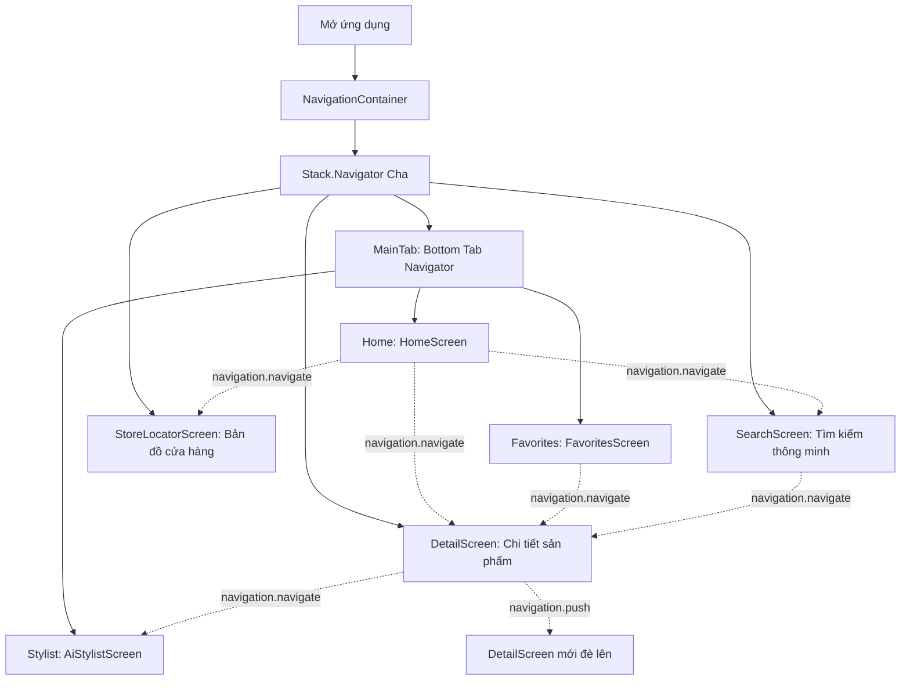
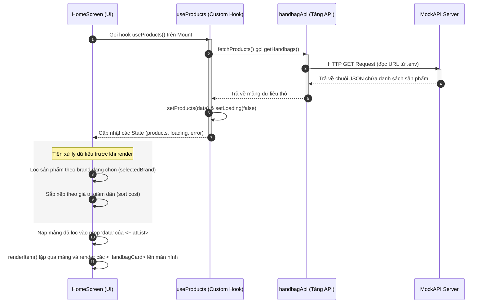

# 📚 HƯỚNG DẪN KIẾN TRÚC & LUỒNG RENDER HỆ THỐNG
> **Tài liệu đào tạo toàn diện dành cho lập trình viên mới học React Native**  
> Dự án: **Luxury Handbag Boutique App** (Expo / Gemini AI / AsyncStorage / Maps)

---

## 📂 I. Tổng Quan Cấu Trúc Dự Án (Project Structure)

Dự án được tổ chức theo mô hình phân lớp rõ ràng, giúp tách biệt giao diện hiển thị (UI), logic nghiệp vụ (Services) và kết nối mạng (API):

```text
rn1/
├── App.js                         # Component gốc (Root) cấu hình bọc điều hướng
├── index.js                       # Điểm mồi khởi chạy đầu tiên trên thiết bị di động
├── package.json                   # Quản lý thư viện phụ thuộc và các câu lệnh chạy ứng dụng
└── src/
    ├── api/                       # TẦNG KẾT NỐI MẠNG (NETWORK LAYERS)
    │   └── handbagApi.js          # Fetch dữ liệu túi xách từ MockAPI
    ├── components/                # THÀNH PHẦN GIAO DIỆN DÙNG CHUNG (REUSABLE UI)
    │   ├── BrandFilter.js         # Thanh trượt ngang lọc nhãn hiệu
    │   ├── HandbagCard.js         # Card hiển thị sản phẩm trên lưới Grid
    │   ├── RatingSummary.js       # Thống kê và hiển thị chi tiết nhận xét
    │   └── SearchCard.js          # Card kết quả hiển thị trên màn hình tìm kiếm
    ├── constants/                 # HẰNG SỐ HỆ THỐNG
    │   └── colors.js              # Bảng màu sắc thiết kế chủ đạo (Luxury theme)
    ├── hooks/                     # LOGIC ĐỘC LẬP TÁI SỬ DỤNG (REACT CUSTOM HOOKS)
    │   └── useProducts.js         # Tách biệt logic fetch/refresh/error khỏi giao diện
    ├── layouts/                   # KHUNG ĐỊNH DẠNG LAYOUT
    │   └── MainLayout.js          # Bọc SafeAreaView chống tràn màn hình tai thỏ
    ├── navigation/                # KIẾN TRÚC ĐỊNH TUYẾN MÀN HÌNH (ROUTING)
    │   └── AppNavigator.js        # Cấu hình Stack Navigator & Bottom Tab Navigator
    ├── screens/                   # CÁC MÀN HÌNH CHÍNH (PAGES)
    │   ├── HomeScreen.js          # Màn hình Boutique trưng bày sản phẩm
    │   ├── DetailScreen.js        # Màn hình chi tiết sản phẩm & gợi ý liên quan
    │   ├── FavoritesScreen.js     # Màn hình lưu trữ & xóa hàng loạt mục yêu thích
    │   ├── SearchScreen.js        # Màn hình tìm kiếm tự nhiên (Natural Language Search)
    │   ├── AiStylistScreen.js     # Màn hình Aura AI tư vấn phối đồ qua Gemini
    │   └── StoreLocatorScreen.js  # Màn hình định vị showroom trên bản đồ GPS
    └── services/                  # TẦNG DỊCH VỤ & BỘ NHỚ ĐỆM (BUSINESS LOGIC)
        ├── favoriteService.js     # Đọc/ghi danh sách yêu thích vào bộ nhớ local
        ├── geminiService.js       # Tích hợp Prompt và kết nối mô hình Gemini
        └── searchHistoryService.js# Lưu trữ lịch sử tìm kiếm cục bộ của người dùng
```

---

## 🚀 II. Luồng Khởi Chạy Ban Đầu (Application Startup Flow)

Khi ứng dụng được khởi động, Expo Go hoặc bản build Native sẽ kích hoạt các tập tin cấu hình gốc theo trình tự sau:

| Bước | Tập tin | Mô tả chi tiết vai trò |
| :--- | :--- | :--- |
| **1** | [index.js](file:///d:/MONHOCKI7/MMA/rn1/index.js) | Gọi `registerRootComponent(App)` để đăng ký Component `App` làm điểm khởi chạy gốc với hệ điều hành điện thoại (iOS/Android). |
| **2** | [App.js](file:///d:/MONHOCKI7/MMA/rn1/App.js) | Bọc toàn bộ ứng dụng trong component `<NavigationContainer>`. Thiết lập cấu hình điều hướng toàn cục và hiển thị thanh trạng thái điện thoại `<StatusBar>`. |
| **3** | [AppNavigator.js](file:///d:/MONHOCKI7/MMA/rn1/src/navigation/AppNavigator.js) | Kích hoạt `Stack.Navigator` chứa màn hình chính và các màn hình phụ. Mặc định tải component `MainTab` chứa Bottom Tab Navigator lên trước mắt người dùng. |

---

## 🗺️ III. Kiến Trúc Điều Hướng Lồng Nhau (Nested Navigation)

Ứng dụng kết hợp giữa **Stack Navigator** (điều hướng đè màn hình) và **Bottom Tab Navigator** (thanh tab ở đáy) để quản lý luồng di chuyển của người dùng:



---

## 🔌 IV. Luồng Gọi API & Đồng Bộ Hóa Dữ Liệu (Data Flow)

Dưới đây là luồng đi chi tiết của dữ liệu từ khi lấy từ Máy chủ (MockAPI) về cho tới khi in ra giao diện sản phẩm:



---

## ⚡ V. Quản Lý Trạng Thái: State, Props & useEffect

> [!IMPORTANT]
> *   **State (Trạng thái)**: Là dữ liệu nội bộ được khai báo và quản lý bởi chính Component đó. Khi State thay đổi, React Native sẽ ngay lập tức vẽ lại giao diện (Re-render).
> *   **Props (Thuộc tính)**: Là dữ liệu được truyền từ Component Cha xuống Component Con. Component con chỉ được đọc và kích hoạt callback chứ không được sửa trực tiếp Props nhận được.

### 1. Bảng so sánh State vs Props thực tế trong dự án

| Thành phần | Loại dữ liệu | Nơi quản lý | Vai trò trong hệ thống |
| :--- | :--- | :--- | :--- |
| **`selectedBrand`** | **State** | `HomeScreen.js` | Lưu trữ thương hiệu người dùng đang chọn để lọc. Khi đổi brand, UI tự cập nhật. |
| **`favorites`** | **State** | `HomeScreen.js` & `FavoritesScreen.js` | Lưu trữ mảng ID túi xách yêu thích để quyết định vẽ trái tim rỗng hay đỏ. |
| **`handbag`** | **Prop** | `HandbagCard.js` | Con nhận dữ liệu từ Cha để in ra tên, giá, ảnh của chiếc túi xách đó. |
| **`onFavoritePress`**| **Prop** | `HandbagCard.js` | Hàm callback do Cha truyền xuống. Khi Con bấm nút tim, hàm này sẽ báo lại cho Cha xử lý. |

### 2. Trình tự thực thi Effects khi mở app
1.  **Component Mount**: `HomeScreen` hiển thị lần đầu tiên.
2.  **useEffect trong Hook khởi chạy**: `useEffect` trong [useProducts.js](file:///d:/MONHOCKI7/MMA/rn1/src/hooks/useProducts.js) chạy trước vì Hook được gọi ngay đầu màn hình:
    ```javascript
    useEffect(() => {
      fetchProducts(); // Tải danh sách túi từ máy chủ MockAPI
    }, []);
    ```
3.  **useFocusEffect của Màn hình khởi chạy**: `useFocusEffect` (dòng 29 trong `HomeScreen.js`) chạy tiếp theo. Nhiệm vụ của nó là đọc danh sách yêu thích từ AsyncStorage về RAM mỗi khi người dùng chuyển tab quay lại màn hình Home.

---

## 💾 VI. Bộ Nhớ Cục Bộ (AsyncStorage Services)

Ứng dụng sử dụng thư viện `@react-native-async-storage/async-storage` để lưu trữ dữ liệu dưới dạng khóa-giá trị (Key-Value) bền vững trên thiết bị:

| Dịch vụ | Key Lưu Trữ | Kiểu Dữ Liệu | Mục Đích Sử Dụng | Hàm Chính |
| :--- | :--- | :--- | :--- | :--- |
| **[favoriteService.js](file:///d:/MONHOCKI7/MMA/rn1/src/services/favoriteService.js)** | `"FAVORITE_HANDBAGS"` | JSON String (Mảng các object túi xách) | Lưu danh sách túi đã thích để xem ngoại tuyến (offline). | `getFavorites()`, `addFavorite()`, `removeFavorite()`, `removeMultipleFavorites()` |
| **[searchHistoryService.js](file:///d:/MONHOCKI7/MMA/rn1/src/services/searchHistoryService.js)** | `"SEARCH_HISTORY"` | JSON String (Mảng tối đa 5 chuỗi văn bản) | Gợi ý nhanh các cụm từ người dùng đã tìm kiếm trước đó. | `getSearchHistory()`, `addSearchTerm()`, `clearSearchHistory()` |

---

## 🤖 VII. Chi Tiết Cơ Chế Các Tính Năng Nâng Cao

### 1. Tìm Kiếm Thông Minh (Smart Search & Relevance Ranking)

Tính năng tìm kiếm tại [SearchScreen.js](file:///d:/MONHOCKI7/MMA/rn1/src/screens/SearchScreen.js) hoạt động vô cùng thông minh nhờ tầng tiện ích [searchUtils.js](file:///d:/MONHOCKI7/MMA/rn1/src/utils/searchUtils.js):

*   **Bộ phân tích cú pháp tự nhiên (`parseSearchQuery`)**: 
    Nếu người dùng nhập: *"Hermes bag under 500 dollars"*, hệ thống sử dụng Regex để tự nhận diện:
    *   Thương hiệu (`brand`): `"Hermes"`
    *   Giá tối đa (`maxPrice`): `500`
*   **Thuật toán xếp hạng độ liên quan (`rankProducts`)**:
    Các sản phẩm phù hợp sẽ được cho điểm số cụ thể để sắp xếp sản phẩm đúng ý người dùng lên trên cùng:

| Tiêu chí khớp từ khóa | Điểm cộng tích lũy |
| :--- | :--- |
| Khớp hoàn toàn 100% tên sản phẩm | **+100 điểm** |
| Tên sản phẩm bắt đầu bằng từ khóa | **+80 điểm** |
| Khớp tên Thương hiệu (Brand) | **+60 điểm** |
| Khớp tên Danh mục (Category) | **+40 điểm** |
| Khớp Màu sắc sản phẩm (Color) | **+20 điểm** |
| Đánh giá sao trung bình | **+ Cộng thêm điểm sao thực tế (0.0 đến 5.0)** |

---

### 2. Tư Vấn Phong Cách Trực Tuyến Aura AI (Gemini API)

Màn hình [AiStylistScreen.js](file:///d:/MONHOCKI7/MMA/rn1/src/screens/AiStylistScreen.js) tích hợp mô hình AI `gemini-2.5-flash`:

*   **Mã hóa hình ảnh trang phục (Base64)**:
    Khi người dùng tải ảnh từ bộ sưu tập lên, ứng dụng sử dụng `expo-image-picker` cấu hình mã hóa Base64 trực tiếp trên thiết bị để chuyển ảnh thành chuỗi ký tự gửi lên máy chủ AI.
*   **Ngăn chặn AI ảo giác (Chống bịa sản phẩm)**:
    Tại [geminiService.js](file:///d:/MONHOCKI7/MMA/rn1/src/services/geminiService.js), danh sách sản phẩm thực tế từ API được nén thành chuỗi văn bản và nhúng thẳng vào cấu hình **System Instructions**:
    ```javascript
    // Nhúng cơ sở dữ liệu sản phẩm thực tế vào Prompt chỉ dẫn hệ thống của Gemini
    const inventoryText = productsList.map(p => `- [ID: ${p.id}] ${p.brand} ${p.handbagName} (${p.category})`).join('\n');
    ```
    Quy định này buộc Gemini chỉ được chọn tư vấn những chiếc túi thực sự đang có trong kho hàng của Boutique.

---

### 3. Bản Đồ Showroom & Hiệu Ứng Snap (Store Locator)

Màn hình [StoreLocatorScreen.js](file:///d:/MONHOCKI7/MMA/rn1/src/screens/StoreLocatorScreen.js) tích hợp bản đồ với các kỹ thuật UX nâng cao:
*   **Marker**: Hiển thị vị trí tọa độ Showroom bằng các ghim đỏ trên bản đồ.
*   **Snap Card Scroll**: Danh sách thẻ showroom nằm ngang ở đáy màn hình sử dụng thuộc tính `snapToInterval={Dimensions.get("window").width - 40}` để tự động đưa thẻ cửa hàng nằm ngay ngắn chính giữa màn hình sau mỗi lần người dùng vuốt nhẹ.
*   **Camera Pan**: Khi người dùng nhấn chọn một thẻ cửa hàng, hệ thống gọi hàm `animateToRegion` thông qua `mapRef` để bản đồ tự động bay camera chuyển hướng đến đúng vị trí cửa hàng được chọn một cách mượt mà:
    ```javascript
    mapRef.current?.animateToRegion({
      latitude: store.latitude,
      longitude: store.longitude,
      latitudeDelta: 0.008,
      longitudeDelta: 0.008,
    }, 600); // Di chuyển camera mượt mà trong vòng 600ms
    ```

---

## 🛠️ VIII. Phân Tích & Đối Chiếu Các Cải Tiến Hiệu Năng (Senior Performance Tuning)

> [!TIP]
> Dưới đây là bảng so sánh trực quan và mã nguồn đối chiếu giữa cách viết sơ khai (Junior) và cách viết tối ưu hóa (Senior) đã được áp dụng vào dự án:

### 1. Tối ưu hóa ghi nhớ hàm (Re-render)
*   **Vấn đề**: Hàm xử lý nút tim bị khai báo mới liên tục trên RAM mỗi lần re-render HomeScreen, khiến hàng chục component `<HandbagCard>` con bị bắt buộc render lại vô ích.
*   **Cách khắc phục**: Bọc hàm xử lý bằng `useCallback` với dependency `[favorites]`.

```diff
// Sửa đổi tại HomeScreen.js
-  const handleFavoritePress = async (handbag) => {
-    let newFavorites;
-    if (isFavorite(handbag.id)) {
-      newFavorites = await removeFavorite(handbag.id);
-    } else {
-      newFavorites = await addFavorite(handbag);
-    }
-    setFavorites(newFavorites);
-  };
+  const handleFavoritePress = useCallback(async (handbag) => {
+    let newFavorites;
+    if (isFavorite(handbag.id)) {
+      newFavorites = await removeFavorite(handbag.id);
+    } else {
+      newFavorites = await addFavorite(handbag);
+    }
+    setFavorites(newFavorites);
+  }, [favorites]);
```

---

### 2. Tối ưu hóa đọc/ghi bộ nhớ local (Xóa hàng loạt)
*   **Vấn đề**: Xóa nhiều mục yêu thích cùng lúc bằng vòng lặp `for` chạy hàm xóa đơn, gây nghẽn tốc độ do thực hiện đọc/ghi file lặp đi lặp lại liên tiếp.
*   **Cách khắc phục**: Viết hàm xóa gộp một lần `removeMultipleFavorites` và áp dụng vào màn hình xóa hàng loạt.

```diff
// Sửa đổi tại FavoritesScreen.js
-            let current = [...favorites];
-            for (const id of selectedIds) {
-              current = await removeFavorite(id);
-            }
+            const current = await removeMultipleFavorites(selectedIds);
```

---

### 3. Tối ưu hóa lưu đệm sản phẩm liên quan (Tránh spam mạng)
*   **Vấn đề**: Mở trang xem chi tiết sản phẩm nào là trang đó tự động gọi API fetch lại toàn bộ kho hàng để lọc ra 6 sản phẩm liên quan.
*   **Cách khắc phục**: Truyền kèm mảng sản phẩm đang có `allHandbags` qua Navigation Param. Tại `DetailScreen.js`, chỉ gửi request HTTP nếu đi từ luồng không có cache (ví dụ từ trang Favorites):

```javascript
// Sử dụng cache truyền sang hoặc dự phòng gọi API nếu không tìm thấy cache
let allBags = route.params?.allHandbags;
if (!allBags || allBags.length === 0) {
  allBags = await getHandbags(); // Dự phòng (Fallback) khi đi từ tab Favorites sang
}
```
